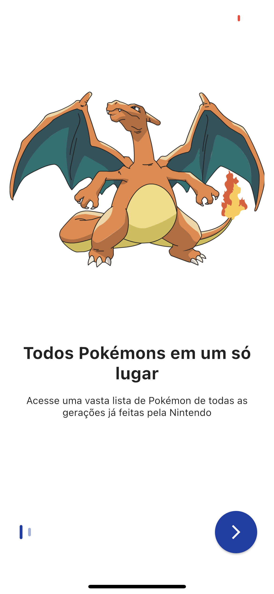
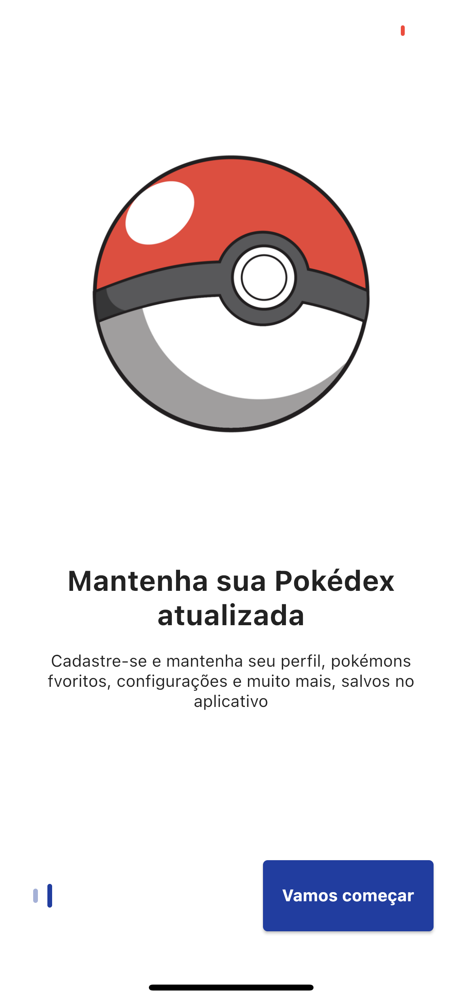
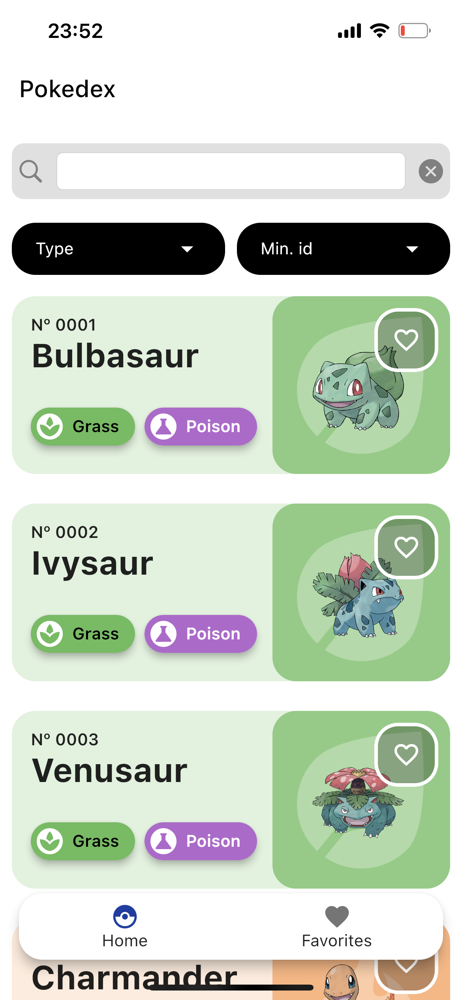
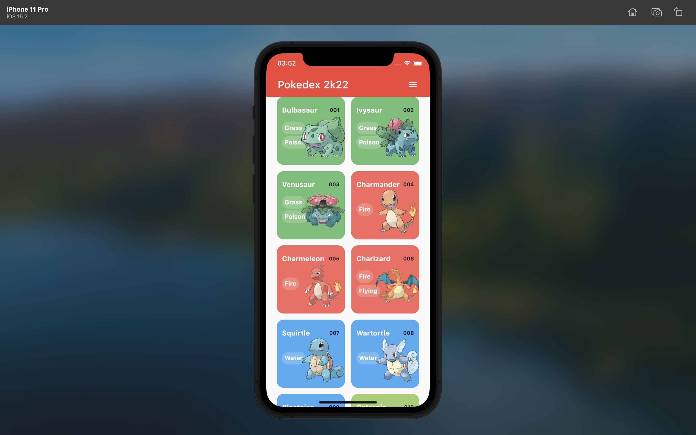
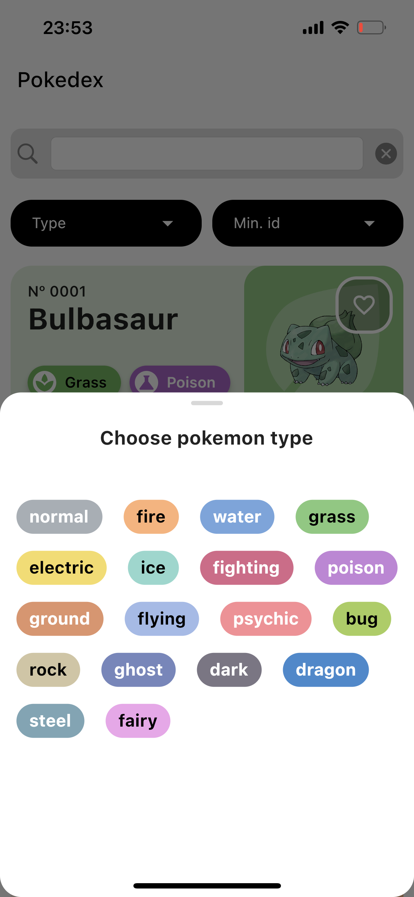
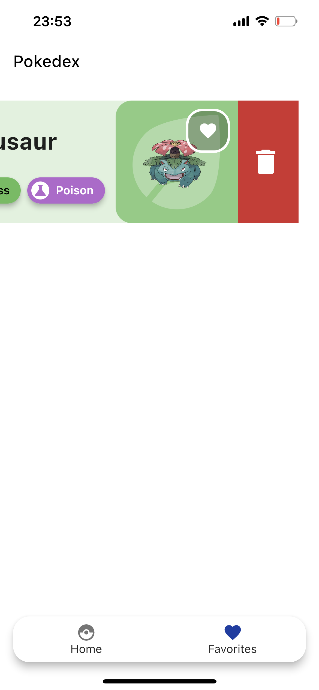
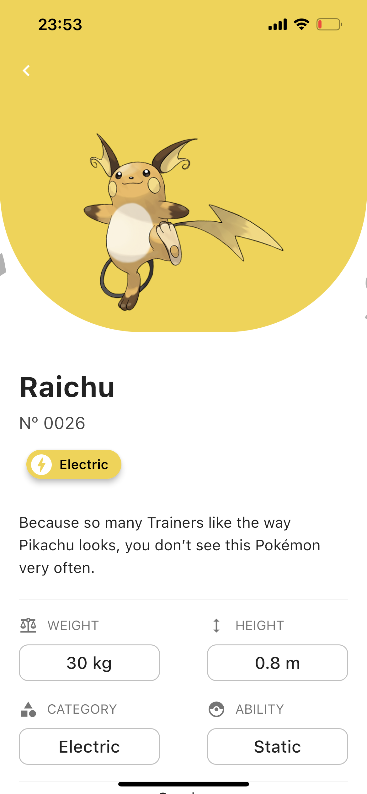
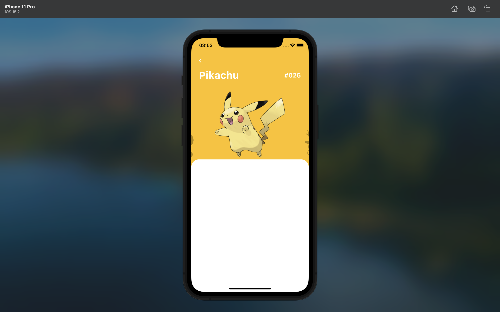

# Pokedex

A new Flutter project.

## Tabela de Conteúdos

- [Pokedex](#pokedex)
  - [Tabela de Conteúdos](#tabela-de-conteúdos)
  - [Eu](#eu)
  - [Descrição](#descrição)
  - [Imagens](#imagens)
    - [Onboard](#onboard)
    - [Tela inicial](#tela-inicial)
    - [Tela inicial (again 😛)](#tela-inicial-again-)
    - [Filtragem por tipo](#filtragem-por-tipo)
    - [Tela de favoritos](#tela-de-favoritos)
    - [Telas de detalhes](#telas-de-detalhes)
      - [Nº 1](#nº-1)
      - [Nº 2 (The great Pikachu 😍)](#nº-2-the-great-pikachu-)
  - [Estado](#estado)
  - [Flutter](#flutter)

## Eu
[Eu sou o Eliude P. C. Vemba](https://github.com/HelioPC) - Software developer.

## Descrição

Pokedex é uma aplicação muito conhecida para visualizar pokemons e seus detalhes.

## Imagens

### Onboard

### Tela inicial

### Tela inicial (again 😛)

### Filtragem por tipo

### Tela de favoritos

### Telas de detalhes

#### Nº 1

#### Nº 2 (The great Pikachu 😍)

## Estado
Still working on. 😒

## Flutter

For help getting started with Flutter, view our
[online documentation](https://flutter.dev/docs), which offers tutorials,
samples, guidance on mobile development, and a full API reference.
