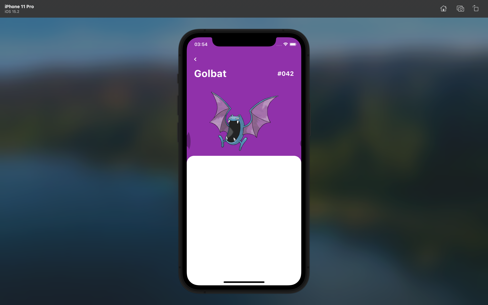

# Pokedex

A new Flutter project.

## Tabela de Conteúdos

* [Eu](#eu)
* [Descrição](#descrição)
* [Imagens](#imagens)
    * [Tela inicial & Editor](#imagens)
    * [Tela inicial](#imagens)
    * [Telas de detalhes](#telas%20de%20detalhes)
        * [Tela nº 1](#nº%201)
        * [Tela nº 2](#nº%202)
        * [Tela nº 3](#nº%203)
* [Flutter](#flutter)

## Eu
[Eu sou o Eliude P. C. Vemba](https://github.com/HelioPC) - Software developer.

## Descrição

Pokedex é uma aplicação muito conhecida para visualizar pokemons e suas
informações, feita através do tutorial do programador (e youtuber ?)
[Renato Mota](https://github.com/RenatoLucasMota).

## Imagens

### Tela inicial

### Tela inicial (again 😛)

### Telas de detalhes

🚧🚦🚨 Até o momento (commit e647a9c9c7c8aa4e25cfed56d5281e723d744672) a tela de
detalhes não foi finalizada. 🚧🚦🚨

#### Nº 1

#### Nº 2 (The great Pikachu 😍)

#### Nº 3

## Estado
Still working on. 😒

## Flutter

For help getting started with Flutter, view our
[online documentation](https://flutter.dev/docs), which offers tutorials,
samples, guidance on mobile development, and a full API reference.
